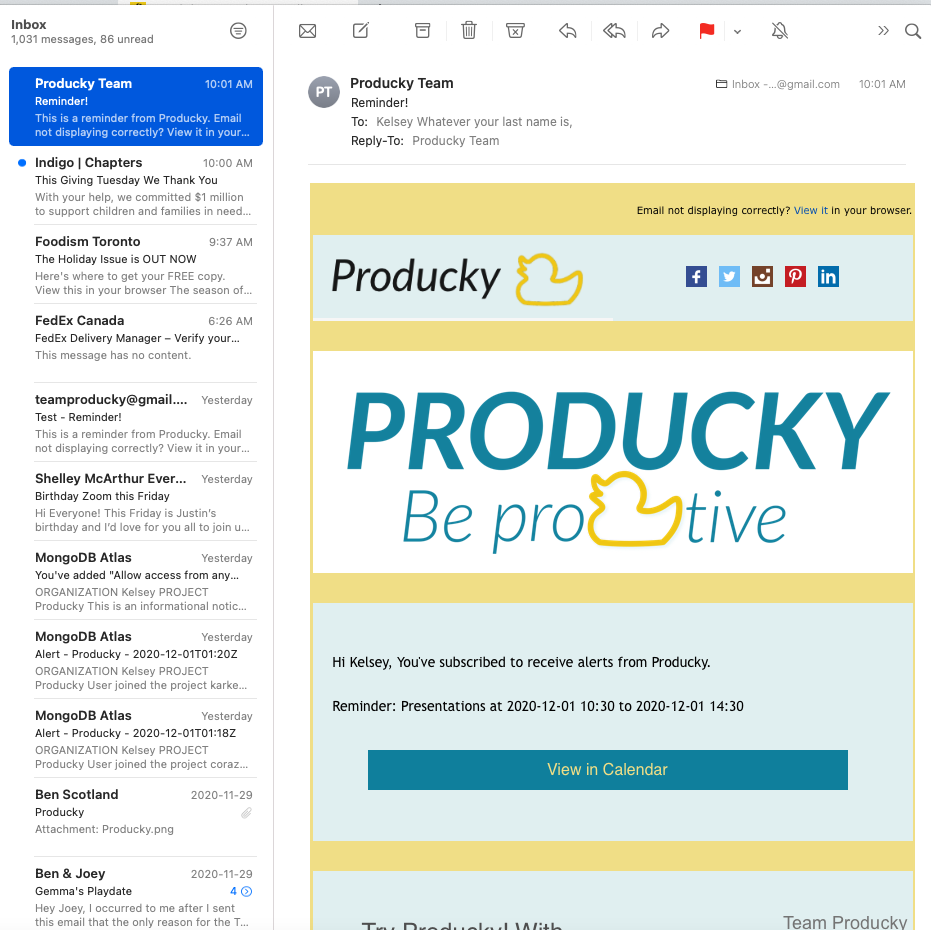

# React Calendar App

* Producky is an application that can improve your productivity. The users will have their own personal profile after logged in. They can schedule or view events, add or delete notes and create kanban todo lists as well as send reminder emails for their events
* Deployed at : https://sleepy-retreat-90049.herokuapp.com/Events

## Tech
* Okta Authentication
* React-Swipeable-View
* Redux
* Material UI
* HTML/CSS
* fullCalendar
* Bootstrap
* Mongoose/Mongodb

## Starting the app locally

Start by installing front and backend dependencies. While in this directory, run the following command:

```
npm install
```

This should install node modules within the server and the client folder.

After both installations complete, run the following command in your terminal:

```
npm start
```

Your app should now be running on. The Express server should intercept any AJAX requests from the client.
## Screenshot
* Home

* Email reminder

## You may need to add Redux dev tool for the browser 
## Road Map
Naturally, Producky is a forward thinking business that is constantly evolving to meet the needs of our users. To do this in the future we would like to :
* Twilio => Send alerts and reminders by SMS
* Dark Mode => Reduce eye-strain for night owls (or ducks)
* Image uploads => Bring imagery to notes
* Share functionality or Slack integration => Send events and notes to team members or colleagues

